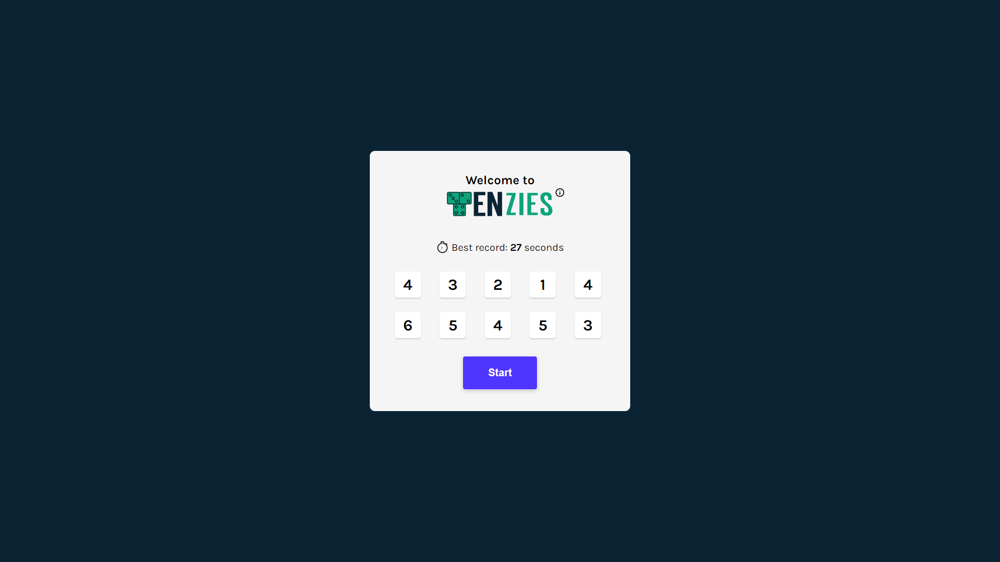

  

# Tenzies

Tenzies is my first React app from the Scrimba course that I wanted to share. It's a dice-based game where the objective is to roll all dice to display the same number. In the game, the player can:
- Roll new dice at the start and for each round
- Click dice to hold/unhold value
- Win when all dice values match
- Timer starts with the game. Beat best record stored in local storage!

## Live Demo

👉 [tenzies.tomaslukes.com](https://tenzies.tomaslukes.com)

## Built With

## Screenshots

  

Desktop

  

Mobile

## What I Learned

As this was my first deployed React app, I learned:
- Setting up a React project with Vite
- Understanding JSX and its syntax
- Applying basic React concepts (props, useState, useEffect.. )
- Implementing BEM for CSS naming to achieve cleaner and more maintainable code
- Adapting and modifying design elements from a Figma file
- Creating a single-page application with more complex logic

## Future Improvements

Having created a minimum viable product, I aim to add stretch goals and learn new skills:
- ✅ Making most out of vanilla CSS with advanced concepts such as CSS variables, flex/grid, animations, BEM naming
- ✅ Adding a timer to track how quickly a player wins
- ✅ Recording the best times a player achieves

## Last update:

- 04/05/2023 - Project is finished for now