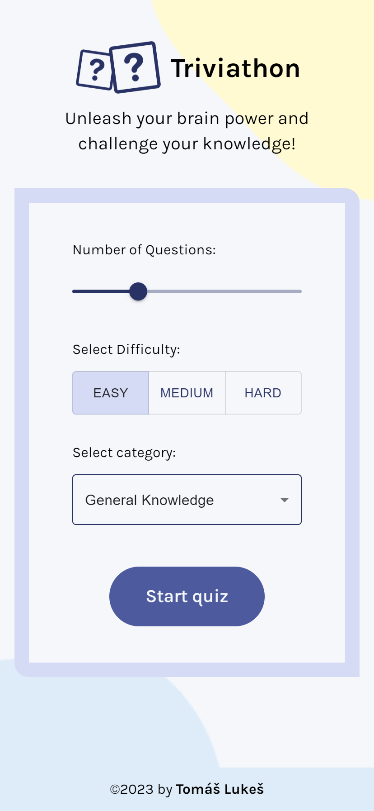

  

# Triviathon

Triviathon is a trivia question game, where users can:
- Choose the number of questions from different categories and set their difficulty
- Answer questions and change their responses, if needed
- Check correct answers and receive a result
- Start a new game with a fresh set of questions

## Live Demo

👉 [triviathon.tomaslukes.com](https://triviathon.tomaslukes.com)

## Built With

## Screenshots

  

Desktop

  

## What I Learned

Building upon my previous knowledge of React basics, I learned:
- Using styling frameworks (Tailwind CSS, Material UI components)
- How to work with APIs and asynchronous code within React
- Creating and organizing larger React single-page applications

## Future Improvements

After creating a minimum viable product, I aim to add stretch goals and learn new skills:
- ✅  Styling the application using Tailwind
- ✅  Using Material UI components for form

## Last update:

- 14/05/2023 - After implementation of Tailwind and Material UI, project is done for now