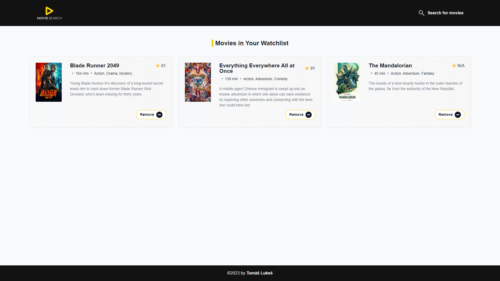
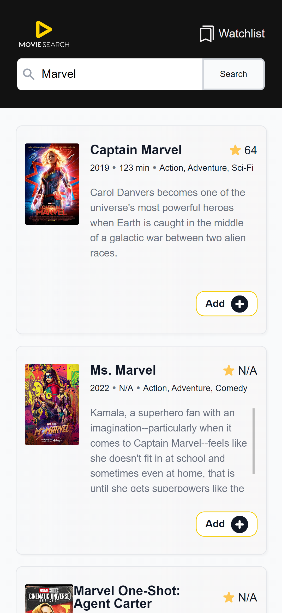

  

# Movie Search (React version)

After creating the same app with vanilla JS and CSS, I wanted to refactor it using React and Sass to compare the development process with and without a frameworks. Movie Search is an app where users can:
- Search for movie titles
- Add movies to the watchlist
- Remove movies from the watchlist
- Store the watchlist in localStorage
- Watch items saved in the watchlist

## Live Demo

👉 [moviesearch.tomaslukes.com](https://moviesearch.tomaslukes.com)

## Built With

## Screenshots

  

Desktop

  

Mobile

## What I Learned

This was my first multi-page React app, where I had the opportunity to:
- Manage app routing using React Router 6
- Combining BEM naming with Sass for advanced, maintainable, and scalable CSS
- Compare the process of developing the same project with basic JS and CSS, and see the benefits that React and Sass offers
- Learn how to prepare a project for later refactoring and scaling (since I used an older basic version of this app)

## Future Improvements

After fully refactoring the app to React and implementing routing, I plan to continue development by:
- ✅ Using more advanced styling techniques (BEM, Sass)
- ✅ Redesigne UI for better responsiveness across devices

## Last update:

- 08/05/2023 - Project is mainly done for now